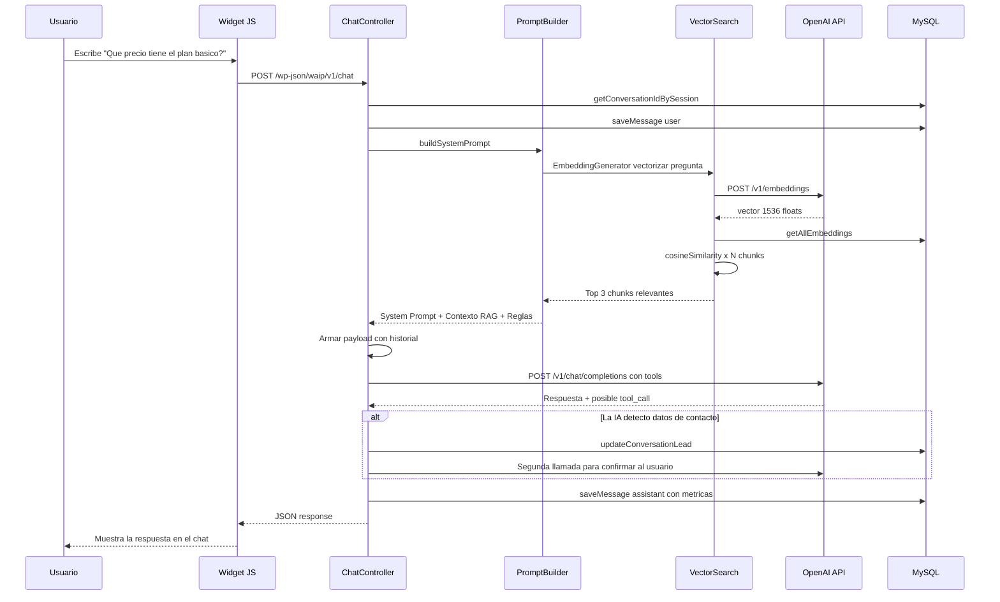
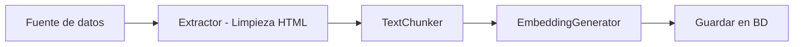

# 🎤 Guión Técnico Completo — Cómo funciona WAIP

> **Propósito:** Documento para explicarle a otra persona (técnica o semi-técnica) cómo está construido este chatbot de IA, paso a paso, con referencias directas al código.

---

## PARTE 1: Visión General (El "Elevator Pitch" Técnico)

> *"WAIP es un plugin nativo de WordPress, escrito en PHP con arquitectura OOP y estándar PSR-4, que implementa un chatbot con IA usando el patrón RAG (Retrieval-Augmented Generation). Tiene su propia base de datos relacional, un motor de búsqueda vectorial construido en PHP puro, captura automática de leads vía Function Calling de OpenAI, y un sistema de análisis asíncrono que califica y notifica prospectos por correo."*

### ¿Qué tecnologías usa?
| Componente | Tecnología |
|---|---|
| Lenguaje Backend | PHP 7.4+ (OOP, PSR-4) |
| Plataforma | WordPress (hooks, REST API, WP Cron) |
| Base de Datos | MySQL (tablas custom con migraciones propias) |
| LLM (Inteligencia Artificial) | API de OpenAI (GPT-4o, GPT-4o-mini, etc.) |
| Embeddings (Vectorización) | API de OpenAI (`text-embedding-3-small`) |
| Frontend del Chat | HTML + CSS + JavaScript vanilla |
| Actualizaciones OTA | GitHub + Plugin Update Checker |

---

## PARTE 2: Estructura de Carpetas (El Mapa del Proyecto)

```
WAIP/
├── waip.php                    ← 🚀 Punto de entrada (bootstrap)
├── composer.json               ← Dependencias PHP
└── src/
    ├── Admin/                  ← 🖥️ Páginas del panel admin
    │   ├── Dashboard.php         → Panel principal con métricas
    │   ├── SettingsPage.php      → Página de configuración
    │   └── PlaygroundPage.php    → Entorno de pruebas del chat
    │
    ├── AI/                     ← 🧠 Todo lo relacionado con IA
    │   ├── Chat/
    │   │   └── PromptBuilder.php → Ensamblador del prompt (RAG + reglas)
    │   ├── Embeddings/
    │   │   └── EmbeddingGenerator.php → Genera vectores desde texto
    │   ├── Providers/
    │   │   ├── AIInterface.php   → Contrato/interfaz (para multi-proveedor)
    │   │   └── OpenAIProvider.php → Implementación concreta de OpenAI
    │   └── Utils/
    │       └── TokenCounter.php  → Calculadora de costos por tokens
    │
    ├── Config/                 ← ⚙️ Configuración centralizada
    │   ├── Constants.php         → Nombres de tablas y opciones
    │   └── SettingsManager.php   → Getters de todas las configuraciones
    │
    ├── Controllers/            ← 🌐 Endpoints REST API
    │   └── ChatController.php    → POST /chat, GET /history, POST /idle
    │
    ├── Database/               ← 🗄️ Migraciones de BD
    │   └── Migrations.php        → Crea 5 tablas custom al activar
    │
    ├── Jobs/                   ← ⏰ Tareas en segundo plano
    │   └── LeadAnalyzerJob.php   → Cron que analiza y notifica leads
    │
    ├── Knowledge/              ← 📚 Motor RAG completo
    │   ├── BatchIndexer.php      → Indexación masiva vía AJAX
    │   ├── DocumentManager.php   → Ingesta de texto y URLs
    │   ├── Extractor.php         → Extrae texto limpio de posts WP
    │   ├── TextChunker.php       → Divide texto en fragmentos con overlap
    │   └── VectorSearch.php      → Búsqueda por similitud del coseno
    │
    ├── Repositories/           ← 💾 Capa de acceso a datos
    │   ├── MessageRepository.php → CRUD de conversaciones y mensajes
    │   └── DocumentRepository.php → CRUD de documentos y embeddings
    │
    ├── Services/               ← 🔧 Servicios transversales
    │   ├── LeadExtractor.php     → Extrae nombre/email/tel con regex + contexto
    │   └── Logger.php            → Sistema de logging a BD
    │
    ├── Views/                  ← 👁️ Plantillas HTML
    │   ├── admin-dashboard.php
    │   ├── admin-knowledge.php
    │   ├── admin-playground.php
    │   ├── admin-settings.php
    │   └── frontend-widget.php   → El widget que ve el usuario final
    │
    ├── Widgets/                ← 🔌 Widget público
    │   └── ChatWidget.php        → Registra CSS/JS e inyecta el chat
    │
    └── Assets/                 ← 🎨 Recursos estáticos
        ├── css/chat.css
        └── js/chat.js
```

> **Explicación clave:** Cada carpeta tiene una responsabilidad única. `Controllers` solo recibe peticiones HTTP. `Repositories` solo habla con la base de datos. `Services` contiene lógica de negocio reutilizable. Esto es el principio **SRP** (Single Responsibility Principle).

---

## PARTE 3: Las 5 Tablas de la Base de Datos

Archivo: [`Migrations.php`](file:///c:/Users/Admin/Documents/GitHub/WAIP/src/Database/Migrations.php)

WAIP **no usa las tablas genéricas de WordPress** (`wp_posts`, `wp_comments`). Crea las suyas propias optimizadas:

| Tabla | Para qué sirve | Columnas clave |
|---|---|---|
| `wp_ai_conversations` | Cada sesión de chat única | `session_id`, `ip_address`, `user_name`, `user_email`, `user_phone`, `ai_summary`, `ai_priority`, `email_sent` |
| `wp_ai_messages` | Cada mensaje individual | `conversation_id` (FK), `role` (user/assistant), `content`, `input_tokens`, `output_tokens`, `total_cost`, `attachment_url` |
| `wp_ai_logs` | Registro de errores y eventos | `level` (INFO/ERROR/DEBUG), `component`, `message` |
| `wp_ai_documents` | Documentos indexados en la base de conocimiento | `title`, `type`, `source_url`, `status` (indexing/indexed/failed), `raw_text` |
| `wp_ai_embeddings` | Vectores matemáticos de cada fragmento | `document_id` (FK), `chunk_text`, `vector_json` (array de 1536 floats serializado) |

> **¿Por qué tablas custom?** Porque WordPress guarda todo en `wp_posts` con un esquema genérico EAV (Entity-Attribute-Value) que es ineficiente para consultas analíticas. Con tablas propias podemos hacer JOINs directos, índices optimizados, y queries como *"dame las 10 conversaciones con lead de prioridad Alta de la última hora"* en milisegundos.

---

## PARTE 4: El Flujo Completo de un Mensaje (Paso a Paso con Código)



### Desglose archivo por archivo:

#### Paso 1: El Widget envía el mensaje
**Archivo:** [`ChatWidget.php`](file:///c:/Users/Admin/Documents/GitHub/WAIP/src/Widgets/ChatWidget.php)

El widget inyecta `chat.js` en el footer del sitio web público, junto con las variables de configuración (colores, nombre del bot, URL de la API) usando `wp_localize_script`. JavaScript hace un `fetch()` a la REST API.

#### Paso 2: El Controller recibe la petición
**Archivo:** [`ChatController.php`](file:///c:/Users/Admin/Documents/GitHub/WAIP/src/Controllers/ChatController.php)

- **Ruta:** `POST /wp-json/waip/v1/chat`
- **Rate Limiting:** Máximo 20 peticiones por IP por minuto (usando `set_transient`)
- **Sanitización:** `sanitize_text_field()` en todos los inputs
- Crea o recupera la conversación con `MessageRepository::getConversationIdBySession()`
- Guarda el mensaje del usuario en BD

#### Paso 3: Se construye el prompt con RAG
**Archivo:** [`PromptBuilder.php`](file:///c:/Users/Admin/Documents/GitHub/WAIP/src/AI/Chat/PromptBuilder.php)

Este es el corazón inteligente. El método `buildSystemPrompt()`:
1. Obtiene el prompt base del admin (configurado en Settings)
2. Inyecta **5 reglas premium** hardcodeadas:
   - Detección automática de idioma
   - Captura de datos con prioridad de formulario
   - Anti-alucinación (restricción de tema)
   - Generación de links de WhatsApp en Markdown
   - Precisión y concisión
3. Si RAG está habilitado:
   - Vectoriza la pregunta del usuario via `EmbeddingGenerator`
   - Busca los chunks más similares via `VectorSearch`
   - Inyecta el contexto encontrado al final del prompt

#### Paso 4: Búsqueda Vectorial (RAG)
**Archivos:** [`VectorSearch.php`](file:///c:/Users/Admin/Documents/GitHub/WAIP/src/Knowledge/VectorSearch.php) + [`EmbeddingGenerator.php`](file:///c:/Users/Admin/Documents/GitHub/WAIP/src/AI/Embeddings/EmbeddingGenerator.php)

```
Pregunta del usuario → API OpenAI Embeddings → Vector [1536 floats]
                                                       ↓
BD: Todos los embeddings ← similitud coseno ← comparar contra cada chunk
                                                       ↓
                                              Top K chunks (ej: 3)
```

La fórmula de similitud coseno implementada en PHP:
```
similitud = (A · B) / (||A|| × ||B||)
```
Donde `A · B` es el producto punto, y `||A||` es la norma euclidiana. Si el resultado está entre 0.20 y 1.0, el chunk es relevante.

#### Paso 5: Llamada al LLM con Function Calling (Tools)
**Archivo:** [`ChatController.php`](file:///c:/Users/Admin/Documents/GitHub/WAIP/src/Controllers/ChatController.php#L104-L171)

Aquí pasa algo muy interesante. No solo le enviamos el mensaje al LLM, sino que también le damos una **herramienta** (`save_contact_info`):

```php
$tools = [
    [
        'type' => 'function',
        'function' => [
            'name' => 'save_contact_info',
            'description' => 'Guarda los datos de contacto del usuario...',
            'parameters' => [
                'type' => 'object',
                'properties' => [
                    'name'  => ['type' => 'string', ...],
                    'email' => ['type' => 'string', ...],
                    'phone' => ['type' => 'string', ...]
                ]
            ]
        ]
    ]
];
```

**¿Cómo funciona esto?**
1. La IA lee la conversación y, si detecta que el usuario mencionó datos de contacto, en lugar de responder con texto, responde con una **tool_call** (llamada a herramienta).
2. Nuestro código intercepta esa llamada, extrae los argumentos (nombre, email, teléfono) y los guarda en la BD.
3. Luego hace una **segunda llamada** al LLM para que genere la respuesta textual de confirmación al usuario.
4. Se suman los tokens de ambas llamadas para el cálculo de costos.

#### Paso 6: Cálculo de costos
**Archivo:** [`TokenCounter.php`](file:///c:/Users/Admin/Documents/GitHub/WAIP/src/AI/Utils/TokenCounter.php)

Cada modelo tiene un precio diferente por millón de tokens. El sistema calcula:
```
costo_input  = tokens_entrada × precio_por_token_entrada
costo_output = tokens_salida  × precio_por_token_salida
costo_total  = costo_input + costo_output
```
Y almacena estas métricas **por mensaje** en la tabla `wp_ai_messages`.

---

## PARTE 5: El Motor RAG (Base de Conocimiento) en Detalle

### ¿Qué es RAG?
**R**etrieval **A**ugmented **G**eneration = No confiar solo en el conocimiento general del LLM, sino inyectar información específica de la empresa antes de cada respuesta.

### Pipeline de Indexación (Cómo se "entrena" con información de la empresa)



#### Fuentes soportadas:
| Fuente | Método | Archivo |
|---|---|---|
| **Texto manual** | Admin pega texto en un textarea | `DocumentManager::ingestText()` |
| **URL externa** | Sistema hace scraping con `wp_remote_get` | `DocumentManager::ingestUrl()` |
| **Posts de WordPress** | Indexar posts/páginas publicados | `BatchIndexer::indexPost()` |
| **Crawl de sitio completo** | Extrae todos los enlaces internos y los indexa uno por uno | `DocumentManager::extractInternalLinks()` |

#### El TextChunker — Dividir texto inteligentemente
**Archivo:** [`TextChunker.php`](file:///c:/Users/Admin/Documents/GitHub/WAIP/src/Knowledge/TextChunker.php)

- **Chunk size:** 1000 caracteres por defecto
- **Overlap:** 200 caracteres de solapamiento entre chunks
- **Corte inteligente:** Busca el último `. ` (punto y espacio) para no cortar una oración a la mitad. Si no encuentra punto, busca el último espacio.

```
Texto original (3000 chars):
[==========CHUNK 1==========]
                    [==========CHUNK 2==========]
                                        [==========CHUNK 3==========]
                    ↑ overlap ↑         ↑ overlap ↑
```

> **¿Por qué overlap?** Si una respuesta clave está justo en el borde entre dos chunks, sin overlap se perdería. Con 200 chars de solapamiento, la información del borde aparece en ambos chunks.

---

## PARTE 6: Sistema de Leads (CRM Inteligente)

### Capa 1: Captura en Tiempo Real (Function Calling)
- Cuando el usuario chatea, la IA decide si debe llamar a `save_contact_info`
- Los datos se guardan instantáneamente en `wp_ai_conversations`

### Capa 2: Extracción por Regex (Respaldo)
**Archivo:** [`LeadExtractor.php`](file:///c:/Users/Admin/Documents/GitHub/WAIP/src/Services/LeadExtractor.php)

Un sistema de respaldo que analiza mensajes con expresiones regulares:
- **Email:** `/[a-zA-Z0-9._%+-]+@[a-zA-Z0-9.-]+\.[a-zA-Z]{2,}/`
- **Teléfono:** Detecta formatos internacionales (ej: +57 301 620 5460) y valida entre 7-15 dígitos
- **Nombre:** Detecta patrones como *"mi nombre es..."*, *"soy..."*, *"me llamo..."*
- **Inferencia contextual:** Si el bot preguntó *"¿cuál es tu nombre?"* y el usuario respondió solo 1-3 palabras, infiere que es un nombre (excluyendo saludos como "hola", "gracias", etc.)

### Capa 3: Análisis Asíncrono (Cron Job)
**Archivo:** [`LeadAnalyzerJob.php`](file:///c:/Users/Admin/Documents/GitHub/WAIP/src/Jobs/LeadAnalyzerJob.php)

Un proceso que corre **cada hora** vía WP Cron:
1. Busca conversaciones con datos de contacto que no hayan sido procesadas (`email_sent = 0`)
2. Formatea todo el historial del chat
3. Se lo envía a un LLM barato (`gpt-4o-mini`, temperature 0.1) con un prompt de **triage de ventas**
4. El LLM clasifica:
   - 🔴 **Alta:** Urgencia clara o altísima intención de compra
   - 🟡 **Media:** Interés normal, pide información
   - 🟢 **Baja:** Solo saludó o dejó datos sin preguntar nada útil
5. Guarda el `ai_summary` y `ai_priority` en la BD
6. **Envía un correo HTML** al equipo comercial con el resumen, prioridad y chat completo

---

## PARTE 7: Seguridad

| Mecanismo | Implementación |
|---|---|
| **API Key encriptada** | Se guarda como `WAIP_ENC:` + base64 en la BD. Se desencripta solo en memoria al usarla. En el admin se muestra enmascarada (`sk-ab****wxyz`). |
| **Rate Limiting** | 20 requests/minuto por IP usando WordPress Transients |
| **Sanitización** | `sanitize_text_field()`, `sanitize_email()`, `esc_url_raw()` en todos los inputs |
| **CSRF** | Nonces de WordPress (`check_ajax_referer`, `check_admin_referer`) en todas las acciones admin |
| **Permisos** | `current_user_can('manage_options')` en endpoints de admin |
| **Anti Direct Access** | `if (!defined('ABSPATH')) exit;` en cada archivo PHP |

---

## PARTE 8: Sistema de Configuración (White-Label)

**Archivo:** [`SettingsManager.php`](file:///c:/Users/Admin/Documents/GitHub/WAIP/src/Config/SettingsManager.php) + [`Constants.php`](file:///c:/Users/Admin/Documents/GitHub/WAIP/src/Config/Constants.php)

Todo es configurable desde el admin de WordPress, sin tocar código:

| Parámetro | Ejemplo |
|---|---|
| Nombre del asistente | *"Coodelsur Bot"* |
| Logo del asistente | URL de imagen |
| Color primario/secundario | `#406ff3`, `#a855f7` |
| System Prompt | *"Eres el asesor virtual de..."* |
| Mensaje de bienvenida | *"¡Hola! ¿En qué te ayudo?"* |
| Mensaje de inactividad | *"¿Sigues por ahí?"* |
| Tiempo de inactividad | 5 minutos |
| Número de WhatsApp | `+573016205460` |
| Modelo de IA | `gpt-4o-mini` |
| RAG habilitado | Sí/No |
| Max chunks RAG | 3 |
| Modo Simulador | Respuestas fake sin gastar API |
| Mensaje de mantenimiento | Fallback cuando la API falla |
| Visibilidad pública | Activar/desactivar el chat |

---

## PARTE 9: Patrón de Diseño — Interfaces y Abstracción del Proveedor de IA

**Archivo:** [`AIInterface.php`](file:///c:/Users/Admin/Documents/GitHub/WAIP/src/AI/Providers/AIInterface.php)

```php
interface AIInterface {
    public function generateResponse(array $messages, array $options = []);
}
```

Esta interface permite que mañana se pueda crear un `AnthropicProvider.php` o `GeminiProvider.php` que implemente el mismo contrato, y el `ChatController` no tenga que cambiar ni una línea. Esto es el principio **OCP** (Open/Closed Principle) de SOLID.

---

## PARTE 10: Actualizaciones OTA (Over-The-Air)

Como el plugin NO está en el repositorio oficial de WordPress.org, usa la librería Plugin Update Checker conectada al repositorio de GitHub (`ChatBotWaip/WAIP`, rama `main`).

Cuando se hace un push/merge a `main`, los clientes con el plugin instalado ven la notificación de actualización directamente en su panel de WordPress, igual que cualquier otro plugin, y lo actualizan con un clic.

---

## PARTE 11: Funcionalidades Extra

### Modo Simulador
- Permite probar todo el flujo visual sin gastar un centavo en la API de OpenAI
- El ChatController responde con mensajes dummy hardcodeados
- Ideal para demos con clientes o para probar el CSS/JS

### Playground (Entorno de Pruebas)
**Archivo:** [`PlaygroundPage.php`](file:///c:/Users/Admin/Documents/GitHub/WAIP/src/Admin/PlaygroundPage.php)
- Renderiza una copia del widget de chat dentro del panel de administración
- Permite al admin probar el bot exactamente como lo vería un usuario final

### Soporte de Imágenes (Visión)
- El chat acepta `attachment` en base64
- Se envía al LLM usando el formato de **Vision API** de OpenAI
- Permite que el usuario suba una foto y la IA la analice

### Limpieza Automática
- `MessageRepository::deleteOldConversations()` elimina conversaciones vacías y mayores de 30 días

---

## 📋 LISTADO DE POSIBLES PREGUNTAS

### Preguntas Generales / Negocio

1. **¿Cuánto cuesta mantener este bot funcionando al mes?**
   > Solo el consumo de la API de OpenAI. Con GPT-4o-mini, 1000 conversaciones cuestan aproximadamente $0.50 - $2.00 USD.

2. **¿Se puede instalar en cualquier sitio web o solo en WordPress?**
   > Actualmente es un plugin de WordPress. Para usarlo fuera de WordPress habría que extraer la lógica backend a una API independiente (ej: en Laravel o Node.js).

3. **¿Qué pasa si OpenAI se cae o hay un error?**
   > El sistema tiene un mensaje de mantenimiento configurable que se muestra al usuario. El error se loguea en `wp_ai_logs` para diagnóstico.

4. **¿Funciona en múltiples idiomas?**
   > Sí. El PromptBuilder incluye una regla que le dice a la IA "detecta automáticamente el idioma del usuario y responde en ese idioma".

5. **¿Se puede cambiar de OpenAI a otro proveedor (Claude, Gemini)?**
   > Sí, gracias a la interface `AIInterface`. Solo hay que crear una nueva clase que implemente `generateResponse()`.

### Preguntas Técnicas sobre RAG

6. **¿Por qué guardan los vectores como JSON en MySQL en vez de usar una base de datos vectorial (Pinecone, Weaviate)?**
   > Para mantener cero dependencias externas y que funcione en cualquier hosting compartido. Es una decisión de MVP. Para escalar a miles de documentos, se recomendaría migrar a una BD vectorial dedicada.

7. **¿No es lento cargar todos los embeddings en memoria para hacer la búsqueda?**
   > Para un MVP con cientos o pocos miles de chunks, es perfectamente rápido (milisegundos). Se vuelve un cuello de botella a partir de ~50,000+ chunks.

8. **¿Qué modelo de embeddings usan y por qué?**
   > `text-embedding-3-small` de OpenAI. Genera vectores de 1536 dimensiones. Es el más barato y rápido, ideal para RAG de escala media.

9. **¿Qué es el overlap en el TextChunker y por qué importa?**
   > Son 200 caracteres compartidos entre chunks consecutivos. Si una respuesta clave cae en el borde entre dos chunks, el overlap garantiza que al menos uno de los dos chunks la contenga completa.

10. **¿Cómo deciden cuántos chunks inyectar al prompt?**
    > Es configurable (`waip_max_chunks`, default 3). Más chunks = más contexto pero más tokens gastados. 3 es un buen balance.

### Preguntas Técnicas sobre Arquitectura

11. **¿Por qué no usan un framework PHP como Laravel?**
    > Porque el producto está diseñado para vivir dentro del ecosistema de WordPress. Usar Laravel obligaría a tener un servidor separado, incrementando costos y complejidad.

12. **¿Qué es el patrón Repository y por qué lo usan?**
    > Aísla las queries SQL del resto del código. Si mañana se cambia MySQL por PostgreSQL, solo se modifican los Repositories, no los Controllers ni los Services.

13. **¿Qué son los hooks de WordPress (`add_action`, `add_filter`) que aparecen en el código?**
    > Son el sistema de eventos de WordPress. Permiten "engancharse" al ciclo de vida del CMS. Por ejemplo, `add_action('rest_api_init', ...)` ejecuta código cuando WordPress inicializa su API REST.

14. **¿Cómo funciona el autoloading PSR-4?**
    > En `waip.php` se registra un autoloader que traduce `Waip\AI\Chat\PromptBuilder` a `src/AI/Chat/PromptBuilder.php`. Así no hay que hacer `require` manual de cada archivo.

### Preguntas sobre Leads

15. **¿Cuál es la diferencia entre Function Calling y el LeadExtractor con regex?**
    > Function Calling es el método primario y más inteligente: la IA entiende el contexto y decide cuándo guardar. El LeadExtractor con regex es un respaldo más básico que analiza los mensajes buscando patrones de texto (email, teléfono).

16. **¿El LeadAnalyzerJob no es costoso si usa IA para cada conversación?**
    > Usa `gpt-4o-mini` con temperature 0.1 (determinístico y barato). Clasificar una conversación cuesta fracciones de centavo. Procesa máximo 10 por ejecución para no saturar.

17. **¿Se pueden ver los leads sin esperar el correo?**
    > Sí, el Dashboard muestra todas las conversaciones con sus datos de contacto, resumen de IA y prioridad en tiempo real.

### Preguntas sobre Seguridad

18. **¿La API Key se guarda en texto plano?**
    > No. Se guarda ofuscada con `WAIP_ENC:` + base64. Se desencripta solo al momento de usarla para llamar a OpenAI.

19. **¿El endpoint del chat es público? ¿No hay riesgo de abuso?**
    > Sí es público (necesario para que cualquier visitante chatee), pero tiene rate limiting de 20 requests/minuto por IP, sanitización estricta de inputs, y el prompt incluye reglas anti-alucinación.

20. **¿Cómo se protegen las acciones de administración?**
    > Con nonces de WordPress (tokens anti-CSRF) y verificación de permisos (`current_user_can('manage_options')`) en cada acción admin.

### Preguntas sobre Escalabilidad

21. **¿Qué pasa si el bot tiene miles de conversaciones simultáneas?**
    > WordPress no está diseñado para alta concurrencia. Para ese escenario se recomendaría: cache de embeddings en Redis, cola de mensajes para el LLM, y potencialmente separar la API REST del chat en un microservicio.

22. **¿Se puede tener más de un bot en el mismo sitio?**
    > Actualmente no, es single-tenant. Soportar múltiples bots requeriría agregar un `bot_id` a las tablas y al flujo de configuración.

23. **¿Se podría convertir esto en un SaaS multi-cliente?**
    > Sí, pero requeriría una capa de multi-tenancy (separar datos por cliente), un sistema de billing, y probablemente migrarlo fuera de WordPress a un framework más robusto.
